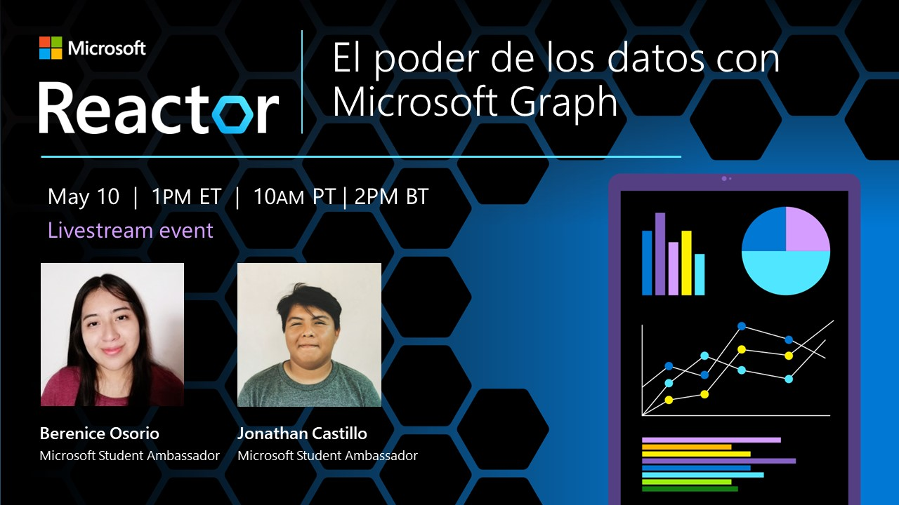

# Microsoft Graph 101

## Resumen
> En este repositorio se recopila información relacionada con el uso de la API de Microsoft Graph. Se incluyen ejemplos de código y guías para el uso de la API.

## Objetivos de aprendizaje

Al final de este workshop:
- Comprenderás el uso de la API de Microsoft Graph.
- Usarás la API para un caso de estudio específico dentro del mundo empresarial.

## Requisitos previos   
- Familiaridad con Azure y Azure AD.
- Conocimientos básicos de APIs.
- Acceso administrativo a tu organización, o en su defecto, obtén un tenant de prueba [aquí](https://cdx.transform.microsoft.com/).

## Caso de estudio
La empresa XYZ, una compañía de tecnología, requiere de una API para recopilar datos sobre los perfiles de sus empleados y sus actividades. Los datos se utilizarán para analizar el rendimiento y la productividad de los empleados.

La API deberá obtener información sobre los perfiles de la organización, lo que incluye determinar los perfiles activos e inactivos. Los criterios para determinar si un perfil está activo incluyen la frecuencia con la que se accede a las aplicaciones de la empresa, como Teams, Outlook, Sharepoint y Yammer.

Además de determinar la actividad de los perfiles, la API también deberá proporcionar información sobre el número de llamadas y chats que se han realizado por cada usuario con los datos desglosados por fechas, lo que permitirá a la empresa analizar el uso de las comunicaciones por parte de los empleados.

Finalmente, la API también proporcionará información sobre el tráfico de información. Esto incluye información sobre el tipo y tamaño de los archivos que se comparten entre los empleados. Esta información es útil para determinar cómo se comparte la información en la empresa y para garantizar que se sigan las políticas de seguridad de la información.

Los datos obtenidos se utilizaran para identificar áreas de mejora y para implementar cambios en la empresa para aumentar la eficiencia y el rendimiento. Entonces ¿cuál herramienta deberá adoptar la empresa?

## Contenido

Después de una  riguroza búsqueda y análisis, la empresa ha decidido que la mejor herramienta para cumplir con sus necesidades es Microsoft Graph. 

Microsoft Graph es una API (Interfaz de Programación de Aplicaciones) que proporciona acceso a datos y funcionalidades de Microsoft 365. 

Microsoft Graph permite a desarrolladores acceder a una amplia variedad de datos y funcionalidades de Microsoft, incluyendo los datos de usuario y organización, los datos de Office 365, los datos de Azure Active Directory, los datos de OneDrive, los datos de Exchange y muchos otros. También proporciona acceso a funcionalidades como la autenticación, la gestión de identidades, el envío de correo electrónico, la gestión de calendarios y la gestión de archivos.

A continuación, encontrarás información sobre Microsoft Graph y herramientas adicinales para la solución. 

- [Introducción a Microsoft Graph.](content/graph-explorer.md)
- [Graph Explorer](content/graph-explorer.md)

- [Uso de la API](content/API.md)

- [Postman]()

- [Power BI]()

## Video
Acompáñanos en este video de guía y aprende visualmente.

## Recursos

- [Graph Explorer](https://developer.microsoft.com/en-us/graph/graph-explorer) :computer:
- [Documentación](https://learn.microsoft.com/es-es/graph/overview) :books:
- [Organización en GitHub](https://github.com/microsoftgraph) :books: 
- [Getting started with Microsoft Graph](https://youtube.com/playlist?list=PLWZJrkeLOrbY-OrrFV_oKezJ9O86oMNrf) :movie_camera: 
- [Microsoft Graph Fundamentals for Beginners](https://youtube.com/playlist?list=PLWZJrkeLOrbbmGIW-7znaSpRinp8d-1Dt) :movie_camera: 
- [Microsoft Graph training modules](https://youtube.com/playlist?list=PLWZJrkeLOrbbOve1DVVQsauZX2LN3IEHL) :movie_camera: 
- [Get started with Microsoft Graph](https://youtube.com/playlist?list=PLWZJrkeLOrbYS34TuCMMd9rVrQlAWLquF) :movie_camera: 

## Feedback
Contestando esta encuesta, nos ayudarás a mejorar :)

