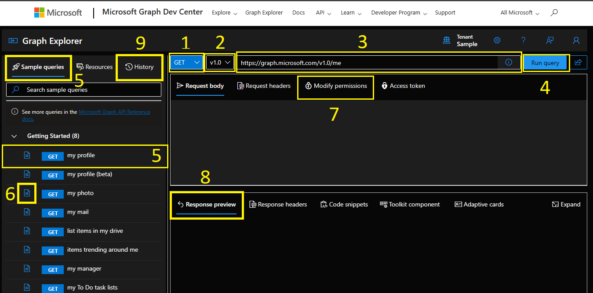
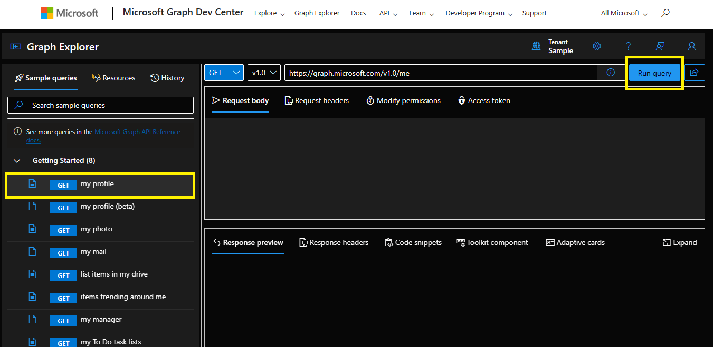
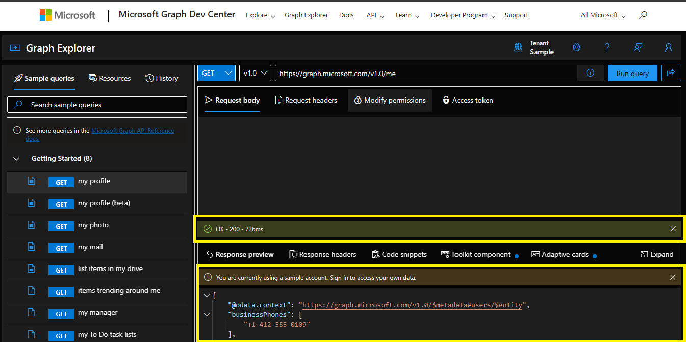
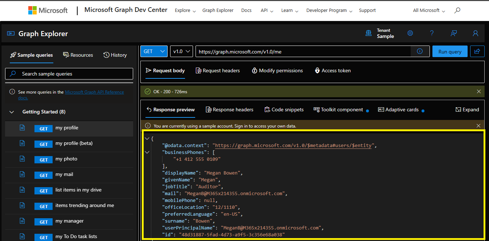

# Explorando Graph Explorer

## ¿Qué es?
Antes de construir aplicaciones basadas en servicios de terceros, suelen ser necesarias pruebas de funcionamiento. En el caso de la API de Microsoft Graph, existe Microsoft Graph Explorer. Una herramienta gratuita de código abierto disponible desde cualquier navegador moderno; pensada para que desarrolladores puedan:

- Probar las API de Microsoft Graph.
- Obtener información sobre los permisos necesarios para las distintas API.
- Explorar todos los recursos disponibles en Microsoft Graph.
- Explorar los componentes del kit de herramientas de Microsoft Graph, las tarjetas adaptables y los fragmentos de código para las consultas.

Para hacer uso de Microsoft Graph Explorer, da click [aquí](https://developer.microsoft.com/graph/graph-explorer.).

## ¿Cómo funciona?

La siguiente captura muestra el Microsoft Graph Explorer.

1. Lista desplegable con verbos HTTP: GET, POST, PUT, PATCH y DELETE.

2. Lista desplegable de versiones: v1.0 o beta.

3. Editor de consultas: para modificar la consulta. 

4. Ejecutar consulta: ver los resultados de la consulta.

5. Consultas de muestra de la API: listas para buscar y probar. Cuando se selecciona una opción, esta se modificará en el editor de consultas. 

6. Vínculos a la documentación de API de cada consulta de ejemplo.

7. Pestaña Modificar permisos: donde se enumeran todos los permisos que pueden necesitarse para ejecutar la consulta. 

8. Response preview: en formato JSON. 

9. History: todas las consultas que se ejecutan en el Explorador de Graph se guardan durante 30 días en la pestaña Historial. 

### Realiza solicitudes

Como primer ejemplo, podemos realizar una consulta a nuestro perfil. Para esto, usaremos una de las consultas de muestra, estas están dispnonibles para usar aunque no hayas iniciado sesión e un tenant de prueba. 

1. Ve a la parte lateral derecha y selecciona `my profile` dentro del menú de `getting started`. Esto cambiará el endpoint dentro del editor de consultas. Da click en `Run query`. Y espera la respuesta.

2. Observa que además del resultado de la consulta en `Response preview`, se habilita un cuadro con un código de status de la consulta. Un 200 indica que todo ha ido bien, para saber más de códigos de status da click [aquí](https://http.cat/?azure-portal=true).

4. Puedes ampliar el cuadro de `Response preview` para acceder a la respuesta JSON completa.

https://learn.microsoft.com/es-mx/graph/graph-explorer/graph-explorer-overview?context=graph%2Fapi%2F1.0&view=graph-rest-1.0

https://learn.microsoft.com/es-mx/training/modules/msgraph-intro-overview/4-graph-explorer

https://learn.microsoft.com/es-mx/graph/graph-explorer/graph-explorer-features

https://github.com/microsoftgraph/microsoft-graph-explorer-v4